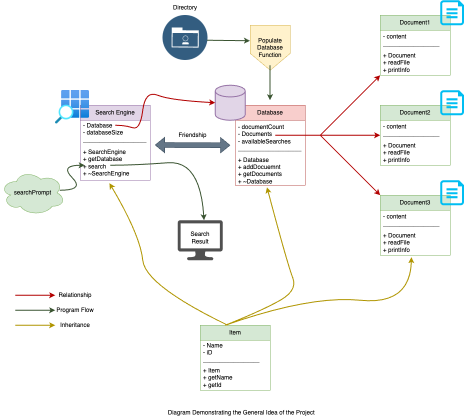
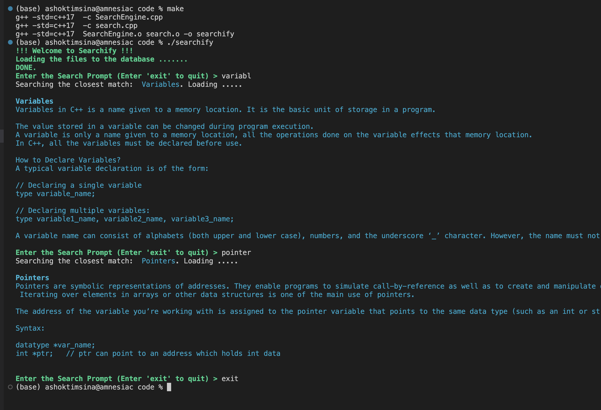

## Usage Instruction
Follow these steps to run this program on your machine. 
1. Clone this repository
```properties
git clone https://github.com/OOP-NYUAD/project-fall2023-timsinashok.git
``` 

2. cd into the directory and then to the code directory
```properties 
cd project-fall2023-timsinashok/code
```
3. Then run the command make

```properties 
make
```

4. You should soon see the welcome message. You can add documents to the data directory to include more items to the search.

# Report
# Searchify
### Introduction
Imagine you have a huge directory consisting of thousands of articles and you want to search through those articles. Say, you want to find the letter that you wrote to your best friend as an assignment for English class in grade 5.  How would you do it? Would you open the thousands of files one by one and read the title to know whether the document is the one you are searching for? Probably not right because we have search engines ubiquitously present around us. The file explorer on Windows and Finder on Mac have their own search engine which allows users to make search seconds.   

So, Let's look into what makes a search engine. ChatGPT says "A search engine is a software tool that scours vast databases for user-defined keywords, returning relevant information swiftly by indexing and ranking web content." Seems like the word search engine is reserved for web searches. But isn't every search similar? Isn't searching trying to find something from a pile of things? I think it is. Search engines like Google search data from the millions of web pages on the internet. Basically, those web pages contain words and the search engine tries to find the pages that have  the closest match and display them to you. Then, are search engines this simple? Ans: Both Yes and No. Technically, when you search you look into all the available options and see if the thing you want to search for matches with any of the available options or not. This is exactly what search engine does. But, the search engine has to deal with a huge amount of data and it might not be efficient to keep on looking at the available options. So there are various complicated processes involved in making an efficient and robust search engine like Google.

Ignoring the complexity, here, we are interested in building a small search engine that will do the search for us.  

### Approach

Developing a full-fledged search engine is complicated so here, we aim to develop the simplest version of the search engine which will run on the terminal and find documents stored in the directory.  

This was not my initial plan though. Initially, I wanted to use Google Custom Search API to make a search using and displaying content on the terminal. That was interesting as it would eliminate the requirement of GUI to surf the internet. However, by doing this, I would only be displaying content rather than making the search. So I diverged from that idea and decided to make a search engine that would simulate a real search engine. By simulation, I mean using a database, data files, and search algorithm to make the search with the least complexity.  So, I am aiming to build a search engine containing a database of data files and use some type of search algorithm to make the search. 

After some thinking and research, I built a design for the program which is displayed in the diagram below:



In the diagram, there are three kinds of arrows, green, red, and yellow. Let's understand what they indicate. 

Let's start with the red arrow. The red arrow shows the relationship between various classes. It shows that SearchEngine has an object of Database and Database contains different instances of Documents. 

Green Arrow shows how the program flows. First, the Populate Database Function is used to read documents from the directory and add them to the database. Then a search prompt is entered and the search function of SearchEngine performs the search and displays the output on the screen. 

Yellow Arrow shows that Inheritance between classes. So, the Item class is the parent class for all the other classes. 

So basically, we aim to build four classes, Item which will be the parent class for all other classes: SearchEngine, Database, and Document. Item class will have Name and iD variable where iD can be randomly generated using current time. It's meaningful to have getters for these variables. Similarly, The SearchEngine class should have the search function and also hold the database. The database class should dynamically allocate memory to store document objects. It should also have a list of titles of the files that are present in the database. Finally, the document class should have variables to store titles and contents and also the function to read and print contents. 

The major reason to go with this design is that it simulates the structure of a real search engine. It touches on the concept of a database and how information is stored in the database. Similarly, we can use simple algorithms to calculate the distance between strings which will mimic the procedure of real search engines.  

Using the design presented above, the search engine system was built and the result is presented in the solution section.


### Solution

Let's first look into the snapshot of the final product:



The program allows users to enter a search prompt. Then the program looks into the database and displays the closest output to the search prompt. You can see in the diagram that even if the user entered 'variabl', the search engine looked for the closest match and displayed output for the Variable. 


Now, let's look into how the program is implemented. First, we create an object of SearchEngine and populate the database associated with the search engine with documents that are present in the specified directory. (Here Engine is an instance/object of SearhcEngine)

```c++
populateDatabase(Engine.getDatabase(), directory_path);
```
The code above calls populateDatbase function that takes the database associated with the Search Engine and directory path and loads the document into the database. This code executes in the beginning of the program and then we enter the main loop.

The implementation of populateDatabasse function is shown below:

```c++
// file: search.cpp , line: 79-94
// Function to create a database from the given directory path
void populateDatabase(Database* database, const string & directoryPath) {
    for (const auto& file : fs::directory_iterator(directoryPath)) { // using directory iterator to iterate through files in directory
        
        // creating object of document class if the file is a regular file
        if (fs::is_regular_file(file)) {
            Document document(file.path().string());

            //Adding the document to the database
            database->addDocument(document);
            
            // keeping the record of the title of documents as strings to match during searches
            database->add_available_search(document.getName());
        }
    }
}
```
This function utilized the filesystem library which was implemented in C++ 17. This created a complicated issue during the development because the compiler in my local machine used a lower version of C++. It took me a substantial amount of time to realize that and this issue was resolved by creating a makefile and specifying the compiler flags  as '-std-c++17'.

In the above snippet, we create a directory iterator and iterate through the files present in the direcotryPath. After confirming the files are regular files, we create an instance of a document which holds the contents of the file. Then The document is added to the database and also the available_search variable which is used during the search.


In the main loop, we take a search prompt from the user and perform the search after the user enters 'exit'.


```c++
// file: search.cpp, line :58 - 68
while (true) {
        printStyledInfo("Enter the Search Prompt (Enter 'exit' to quit) > "); // asking search prompt from the user
        getline(cin, searchPrompt); // getting search prompt from the user
        if (searchPrompt != "exit") {
            Engine.search(searchPrompt); // calling search function of Engine object to carry out the search
        }
        else {
            break; // Breaking the main loop if the user enters 'exit'
            }
        }
```

The search function of the SearchEngine class takes the search prompt and utilizes Levenshtein distance(see References) to find the sting in the database closest to the search prompt. After that, we loop through the documents in the database to get the document that is closest and display it on the console. 

The implementation of the search function is shown below:

```c++
// file: SearchEngine.cpp , line : 57-85
// main search function
void SearchEngine::search(string searchPrompt){
    string closestMatch = "";
    
    // taking value of minDistance as maximum possible value for int;
    int minDistance = std::numeric_limits<int>::max();

    // using range based for loop on available searches
    for (const std::string& value : (*database).available_searches) {
        int distance = levenshteinDistance(searchPrompt, value); // calculating Levenshtein Distance between search prompt and value 
         // comparing all the distance for all words to get minimum distance
         if (distance < minDistance) { 
            minDistance = distance;
            closestMatch = value;
        }
        }

        cout << "Searching the closest match: " << "\033[36m " << closestMatch << "\033[0m" ;
        cout << ". Loading ....." << endl << endl;

        // searching the closest match available search on database
        for(int i =0; i<databaseSize; i++){
            if((database)->getDocument()[i].getName() == closestMatch){
                (database)->getDocument()[i].printInfo(); // pringing the data of the document
                cout << endl;
            }
        }
}
```

This is how the program goes through the process of database creation and handling search queries from the user. In addition to these interesting implementations, other major implementations include exception handling to handle errors related to opening files, calculating the size of the database, and so on.


### Optimization Concepts
1. Dynamic Memory Allocation: In the program, the size of the document array in the database is dynamically allocated based on the number of files in the directory. Dynamic Memory Allocation helps in making optimal use of memory
```c++
// file: SearchEngine.cpp , line: 99
 Documents = new Document[size];
```

2. Pass by Reference: Passing variables by reference reduces memory usage because we are passing an alias to the variable instead of a copy of the variable. Most of the functions in the program use pass-by reference. 

```c++
// file: search.cpp , line: 15-18
// Forward declaring functions
inline void printStyledInfo(const string& content); // Styled text for displaying messages and logs
int getSize(string& directory_path); // Function to get the size of the directory for database size
void populateDatabase(Database* database, const string& directoryPath); // Function to populate database with data from the directory

```

3.  Destructor for Memory Management: Defining destructors and using them to clear dynamically allocated memory is essential for ensuring optimal use of the resources. In the program, the class database has a destructor which clears memory allocated for the array database.

```c++
// file: SearchEngine.cpp , line: 113-116
// destructor for class Database;
Database::~Database(){
    delete [] Documents;
}
```

4. Inline Function: Inline function can optimize the program by reducing function call overhead. In the program printStyledInfo function is declared inline.
 ```c++
// file: search.cpp , line:16
inline void printStyledInfo(const string& content); // Styled text for displaying messages and logs
```  


### OOP concepts
1. Inheritance: In the program, all classes SearchEngine, Database, and Documents inherit from the class Item. So, those classes contain the protected and the public members of the Item class.   

```c++
// file : SearchEngine.h , line: 11-36
// Base item class which will be inherited by all other classes
class Item {

// defining variables as protected for inheritance;    
protected:
    string Name;
    int iD;

public:
    Item();             // Default constructor to resolve errors
    Item(string name);  // Constructor
    string getName();   // Getter for name
    int getID();        // Getter for id
};

// Document class, inherits from Item
class Document : public Item {
private:
    vector<string> content;

public:
    Document();                           // Default constructor without parameters; required for creating dynamic array;
    Document(string path);                // Constructor with file path of the document
    void readFile(string file_path);      // Function to contents of the file and store in the variables
    void printInfo();                     // Function to print information after search
};
```

2. Encapsulation: Defining variables as private, we can encapsulate them and make them unaccessible and tamperproof outside the class. Here the variables Documents and available_searches are defined as private in Databae class ensuring encapsulation.
```c++
// file: SearchEngine.h , lines: 38-44
class Database : public Item {
private:
    int documentCount;
    Document* Documents;
    vector<string> available_searches; // Vector of string containing title of items present in database```
```

3. Friendship: Declaring one class as a friend of another, allows the friend to access private members of the class. In the program, SearchEngine class is defined as a friend of the Database class. So, the SearchEngine class can look into the available_searches.

```c++
// SearchEngine.h, lines: 38-54
// Database class, inherits from Item
class Database : public Item {
private:
    int documentCount;
    Document* Documents;
    vector<string> available_searches; // Vector of string containing title of items present in database

public:
    // default constructor
    Database(string name, int size);
    void addDocument(const Document& document); // Function to add document to the database
    Document* getDocument();                    // Function that return pointer to the document array
    ~Database();                                // Destructor
    void add_available_search(string name){
        available_searches.push_back(name);}
    friend class SearchEngine;
};
```

4. Constructor Overriding: C++ allows constructor overriding which makes it possible to define multiple constructors which might be helpful for different cases. In this program, there are two constructors for the Document class because we want to create a document by passing the path and also create an array of documents where nothing can be passed.
 
```c++
//file: SearchEngine.cpp , lines: 123-128 
// default constructor
Document::Document(){};

Document::Document(string file_path): Item(""){
    readFile(file_path);
}

```


### References
- [Filesystem Library in C++](https://en.cppreference.com/w/cpp/filesystem)
- [Levenshtein_distance Wikipedia](https://en.wikipedia.org/wiki/Levenshtein_distance)
- [Levenshtein_distance Stack Overflow](https://stackoverflow.com/questions/10727174/damerau-levenshtein-distance-edit-distance-with-transposition-c-implementation)
- [C++17 Filesystem](https://www.codingame.com/playgrounds/5659/c17-filesystem)
- []()


## Self-assessment (2 points)
To ensure you understand the requirements of the project, a checklist in (a) provides a summary of what you should understand and submit. 

### (a) Check-list
Check the list below as they are completed using the [x] symbol.
- [X] Read this document.
- [X] Understand the evaluation scheme.
- [X] Submit code files into this repo under the __code/__ directory.
- [X] Ensure code files can be executed in a Github codespace environment.
- [X] Provide a screenshot of your code's output.
- [X] Submit your report in `Report.md`.
- [X] Complete the self-assessment according to the defined evaluation scheme.
  - [X] Complete the self-assessment table (b) below.
  - [X] Enumerate location of implemented concepts in section (c) below.

I declare that I have read and completed the above checked item in the list: [Insert name], [Insert date]

### (b) Complete this table:
The table below lists the elements in which you project will be assessessed. Please insert a self-assessment score for each element you implemented in the project in the table section (b).

|              | Points | Student's Evaluation     | Instructor's Evaluation |
| ------------ | ------ | ------------------------ | ----------------------- |
| __Code:__    |        |                          |                         |
| Readibility  | 3      | 3 |                         |
| Optimization | 3      | 3 |                         |
| OOP Concepts | 3      | 3 |                         |
| Output       | 3      | 3 |                         |
| Correctness  | 3      | 3 |                         |
| **Report:**  |        |                          |                         |
| Engaging     | 3      | 3 |                         |
| Grammar      | 3      | 3 |                         |
| Structure    | 3      | 3 |                         |
| Visual       | 3      | 3 |                         |
| Content      | 3      | 3 |                         |
| References   | 3      | 3 |                         |
| Total        | 33     | 33 |                         |


### (c) Fill in this section:
In addition to completing the self-assessment table, enumerate the optimization and OOP concepts you implemented and the filename / line number of your implementation. You may list this information after the table in the designated placeholder section (b).

**Optimization**: enumerate the concepts implemented for optimization and their line numbers below.

- *Concept #1*: Dynamic Memory Allocation, *File name / Line numbers(s)*: SearchEngine.cpp / 98-101
- *Concept #2*: Pass by Reference, *File name / Line numbers(s)*: search.cpp / 16 - 19
- *Concept #3*: Exception Handling, *File name / Line numbers(s)*: search.cpp / 67 - 71, SearchEngine.cpp / 144 - 147 
- *Concept #4*: Destructor for Memory Management, *File name / Line numbers(s)*: SearchEngine.cpp / 114-117 , 87-90
- *Concept #5*: Inline Function , *File name / Line numbers(s)*: search.cpp / 16

**OOP Concepts**: enumerate the concepts implemented that demonstrate an OOP approach to programming, and their location in your code (line numbers) below.

- *Concept #1*: Inheritance, *File name / Line numbers(s)*: SearchEngine.h / 27, 39, 57
- *Concept #2*: Encapsulation, *File name / Line numbers(s)*: SearchEngine.h / 15-17, 28-29, 40-43, 58-60
- *Concept #3*: Friendship, *File name / Line numbers(s)*: SearchEngine.h / 53
- *Concept #4*: Constructor Overriding, *File name / Line numbers(s)*: 
SearchEngine.cpp / 20-30, 124-129
